<h1 align="center">Languages / 言語一覧</h1>

This profile is available in <b>43</b> languages. Pick yours below. このプロフィールは <b>43</b> の言語で読めます。下から選んでください。

<a href="#asia">Asia / アジア州</a> · <a href="#europe">Europe / ヨーロッパ州</a> · <a href="#americas">Americas / アメリカ州</a> · <a href="#oceania">Oceania / オセアニア州</a> · <a href="#africa">Africa / アフリカ州</a>

<h2 id="asia">Asia / アジア州 (35)</h2>

### East Asia / 東アジア

| Language | English | 日本語 |
|---|---|---|
| [日本語](README.ja.md) | Japanese | 日本語 |
| [한국어](i18n/README.ko.md) | Korean | 韓国語 |
| [简体中文](i18n/README.zh-Hans.md) | Chinese (Simplified) | 中国語（簡体字） |
| [繁體中文](i18n/README.zh-Hant.md) | Chinese (Traditional) | 中国語（繁体字・香港台湾式） |
| [Монгол](i18n/README.mn.md) | Mongolian | モンゴル語 |

### Southeast Asia / 東南アジア

| Language | English | 日本語 |
|---|---|---|
| [Tagalog](i18n/README.tl.md) | Tagalog | タガログ語 |
| [Tiếng Việt](i18n/README.vi.md) | Vietnamese | ベトナム語 |
| [ລາວ](i18n/README.lo.md) | Lao | ラオス語 |
| [ខ្មែរ](i18n/README.km.md) | Khmer | クメール語 |
| [ไทย](i18n/README.th.md) | Thai | タイ語 |
| [မြန်မာ](i18n/README.my.md) | Burmese | ビルマ語 |
| [Bahasa Melayu](i18n/README.ms.md) | Malay | マレー語 |
| [Bahasa Indonesia](i18n/README.id.md) | Indonesian | インドネシア語 |

### Central Asia / 中央アジア

| Language | English | 日本語 |
|---|---|---|
| [Oʻzbekcha](i18n/README.uz.md) | Uzbek | ウズベク語 |
| [Қазақша](i18n/README.kk.md) | Kazakh | カザフ語 |
| [Кыргызча](i18n/README.ky.md) | Kyrgyz | キルギス語 |
| [Тоҷикӣ](i18n/README.tg.md) | Tajik | タジク語 |
| [Türkmençe](i18n/README.tk.md) | Turkmen | トルクメン語 |

### South Asia / 南アジア

| Language | English | 日本語 |
|---|---|---|
| [हिन्दी](i18n/README.hi.md) | Hindi | ヒンディー語 |
| [বাংলা](i18n/README.bn.md) | Bengali | ベンガル語 |
| [සිංහල](i18n/README.si.md) | Sinhala | シンハラ語 |
| [தமிழ்](i18n/README.ta.md) | Tamil | タミル語 |
| [नेपाली](i18n/README.ne.md) | Nepali | ネパール語 |
| [اردو](i18n/README.ur.md) | Urdu | ウルドゥ語 |
| [རྫོང་ཁ](i18n/README.dz.md) | Dzongkha | ゾンカ語 |
| [ދިވެހި](i18n/README.dv.md) | Dhivehi | ディベヒ語 |
| [دری](i18n/README.prs.md) | Dari | ダリー語 |
| [پښتو](i18n/README.ps.md) | Pashto | パシュトゥ語 |

### West Asia / 西アジア

| Language | English | 日本語 |
|---|---|---|
| [العربية](i18n/README.ar.md) | Arabic | アラビア語 |
| [Türkçe](i18n/README.tr.md) | Turkish | トルコ語 |
| [ქართული](i18n/README.ka.md) | Georgian | グルジア語 |
| [فارسی](i18n/README.fa.md) | Persian | ペルシャ語 |
| [Kurdî (Kurmancî)](i18n/README.ku.md) | Kurdish (Kurmanji) | クルド語 |
| [עברית](i18n/README.he.md) | Hebrew | ヘブライ語 |
| [Azərbaycanca](i18n/README.az.md) | Azerbaijani | アゼルバイジャン語 |

<h2 id="europe">Europe / ヨーロッパ州 (7)</h2>

### Eastern Europe / 東ヨーロッパ

| Language | English | 日本語 |
|---|---|---|
| [Русский](i18n/README.ru.md) | Russian | ロシア語 |
| [Беларуская](i18n/README.be.md) | Belarusian | ベラルーシ語 |
| [Українська](i18n/README.uk.md) | Ukrainian | ウクライナ語 |
| [Čeština](i18n/README.cs.md) | Czech | チェコ語 |
| [Slovenčina](i18n/README.sk.md) | Slovak | スロバキア語 |
| [Magyar](i18n/README.hu.md) | Hungarian | ハンガリー語 |
| [Hrvatski](i18n/README.hr.md) | Croatian | クロアチア語 |

### Southern Europe / 南ヨーロッパ

| Language | English | 日本語 |
|---|---|---|
| [Hrvatski](i18n/README.hr.md) | Croatian | クロアチア語 |

<h2 id="americas">Americas / アメリカ州 (1)</h2>

### North America / 北アメリカ

| Language | English | 日本語 |
|---|---|---|
| [English (US)](README.md) | English (US) | 英語（米国式） |

### Central America / 中央アメリカ

| Language | English | 日本語 |
|---|---|---|
| [English (US)](README.md) | English (US) | 英語（米国式） |

### Caribbean / カリブ海地域

| Language | English | 日本語 |
|---|---|---|
| [English (US)](README.md) | English (US) | 英語（米国式） |

### South America / 南アメリカ

| Language | English | 日本語 |
|---|---|---|
| [English (US)](README.md) | English (US) | 英語（米国式） |

<h2 id="oceania">Oceania / オセアニア州 (0)</h2>

<h2 id="africa">Africa / アフリカ州 (1)</h2>

### North Africa / 北アフリカ

| Language | English | 日本語 |
|---|---|---|
| [العربية](i18n/README.ar.md) | Arabic | アラビア語 |

### West Africa / 西アフリカ

| Language | English | 日本語 |
|---|---|---|
| [العربية](i18n/README.ar.md) | Arabic | アラビア語 |

### Central Africa / 中央アフリカ

| Language | English | 日本語 |
|---|---|---|
| [العربية](i18n/README.ar.md) | Arabic | アラビア語 |

### East Africa / 東アフリカ

| Language | English | 日本語 |
|---|---|---|
| [العربية](i18n/README.ar.md) | Arabic | アラビア語 |

---

The English and Japanese versions are the originals. The other translations were written with care, but some may contain mistakes, especially in languages with few online resources. Corrections are welcome as issues or pull requests. 
原文は英語版と日本語版です。ほかの言語の翻訳には、特に資料の少ない言語で誤りがあるかもしれません。修正は Issue や Pull Request で歓迎します。
